# WinUI Community Toolkit (C++ Port)

This repository contains **C++ ports** of [CommunityToolkit](https://github.com/CommunityToolkit) components.

The goal is to allow seamless usage of these controls in WinUI 3 / C++ projects.

---

## Controls

### MarkdownTextBlock

`MarkdownTextBlock` supports syntax highlighting for **C#, C++, XML, JSON, and Shell**.


### Marquee


### OpacityMaskView
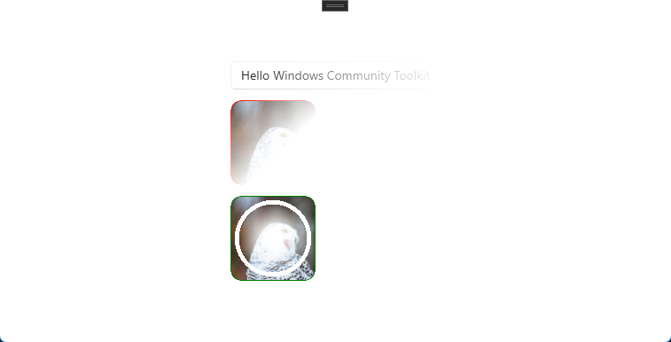

### Shimmer


### TokenView


### ColorPicker / ColorPickerButton
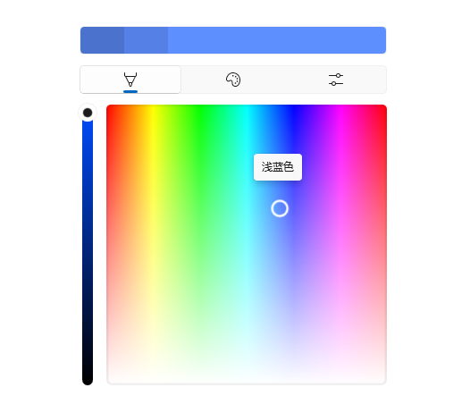

### DockPanel
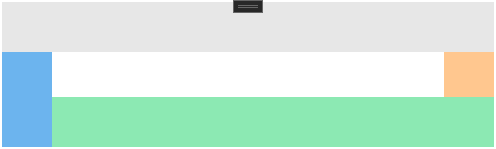

### ImageCropper
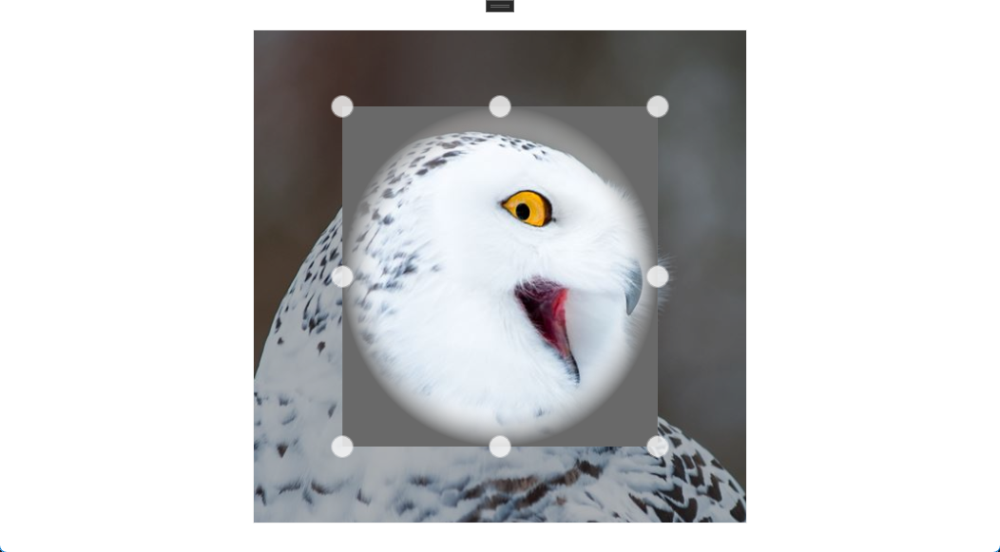

### LayoutTransformControl
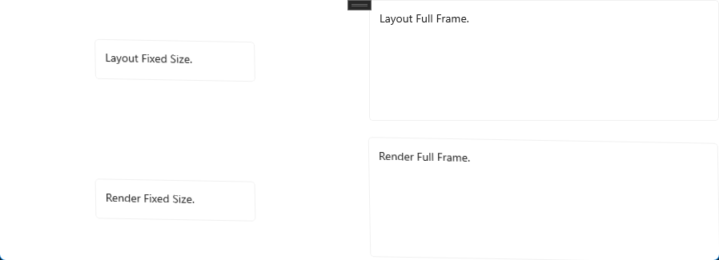

### MetadataControl


### HeaderedContentControl / HeaderedItemsControl / HeaderedTreeView


### RadialGauge
:warning: The `ValueStringFormat` property **does not support .NET string format syntax** and only supports **std::format syntax**.

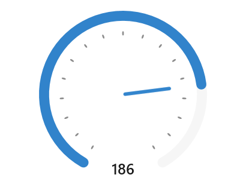

### RangeSelector


### Segmented
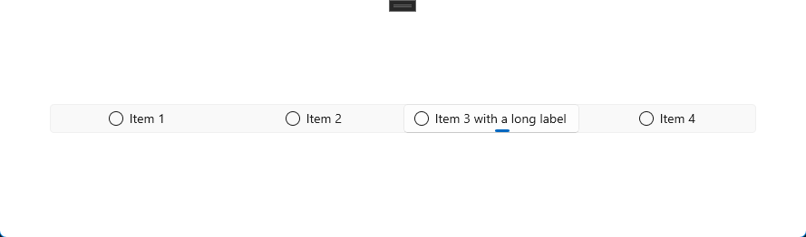

### SettingsCard / SettingsExpander
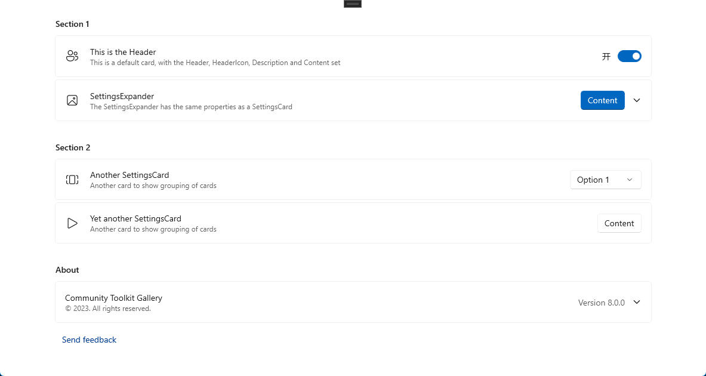

### ContentSizer / GridSplitter / PropertySizer


### StaggeredLayout
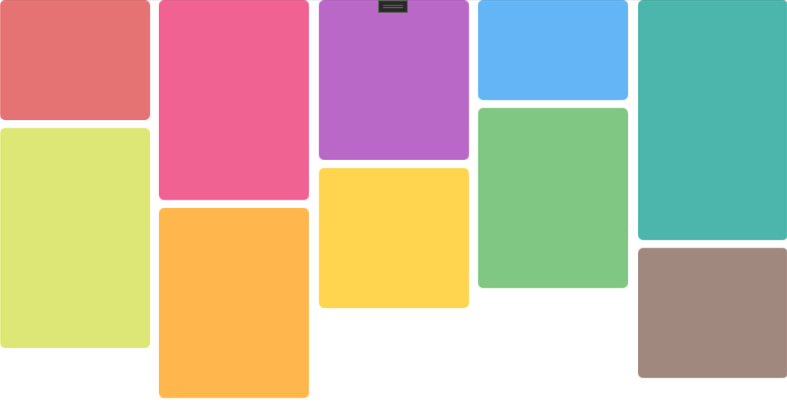

### SwitchPresenter


### TabbedCommandBar
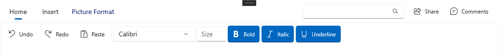

### TokenizingTextBox


### UniformGrid
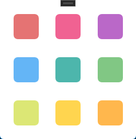

### WrapPanel
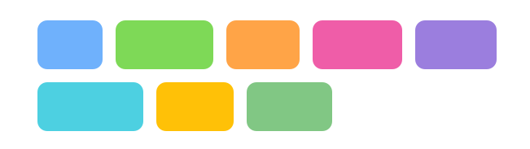

### AttachedCardShadow


---

## Features

- Native C++/WinRT implementation for WinUI 3.
- API style compatible with CommunityToolkit controls.

## Build Steps

- Requires **Visual Studio 2022** or later for compilation.  
- To build `CommunityToolkit.Labs.WinUI`, you need to install **tree-sitter** via vcpkg:

```powershell
vcpkg install tree-sitter:x64-windows-static
```
Markdown parsing uses **md4c** (<https://github.com/mity/md4c>).  
Since vcpkg does not support configuring UTF-16 character set for md4c, the project directly includes the md4c source code.

## Usage

- Download the **release package**.  
- For your project, add a reference to the provided **.winmd** file. Visual Studio will automatically reference the required libraries.
