# WinUI Community Toolkit (C++ Port)

This repository contains **C++ ports** of [CommunityToolkit](https://github.com/CommunityToolkit) components.

The goal is to allow seamless usage of these controls in WinUI 3 / C++ projects.

---

## NuGet Packages

You can install the C++ WinUI Community Toolkit packages via NuGet (it also supports .NET):

| Package | NuGet |
|---------|-------|
| XamlToolkit.WinUI.Native | [](https://www.nuget.org/packages/XamlToolkit.WinUI.Native/) |
| XamlToolkit.WinUI.Helpers.Native | [](https://www.nuget.org/packages/XamlToolkit.WinUI.Helpers.Native/) |
| XamlToolkit.WinUI.Converters.Native | [](https://www.nuget.org/packages/XamlToolkit.WinUI.Converters.Native/) |
| XamlToolkit.WinUI.Media.Native | [](https://www.nuget.org/packages/XamlToolkit.WinUI.Media.Native/) |
| XamlToolkit.WinUI.Controls.Native | [](https://www.nuget.org/packages/XamlToolkit.WinUI.Controls.Native/) |
| XamlToolkit.WinUI.Animations.Native | [](https://www.nuget.org/packages/XamlToolkit.WinUI.Animations.Native/) |
| XamlToolkit.WinUI.Behaviors.Native | [](https://www.nuget.org/packages/XamlToolkit.WinUI.Behaviors.Native/) |
| XamlToolkit.WinUI.Interactivity.Native | [](https://www.nuget.org/packages/XamlToolkit.WinUI.Interactivity.Native/) |
| XamlToolkit.Labs.WinUI.Native | [](https://www.nuget.org/packages/XamlToolkit.Labs.WinUI.Native/) |
| XamlToolkit.WinUI.Rive.Native | [](https://www.nuget.org/packages/XamlToolkit.WinUI.Rive.Native/) |

**Note:** When using the C# version, make sure to set the `<TargetFramework>` to:

```xml
<TargetFramework>net8.0-windows10.0.26100.0</TargetFramework>
```

## Controls

### RivePlayer


Rive support is available via [`XamlToolkit.WinUI.Rive`](https://github.com/lgztx96/XamlToolkit.WinUI.Rive), an optional sub-project maintained in its own repository. See the repository for details.

### Adorner / ResizeElementAdorner


### ColorAnalyzer


### DataTable


### MarkdownTextBlock

`MarkdownTextBlock` supports syntax highlighting for **C#, C++, XML, JSON, Bash and Rust**.


### Marquee
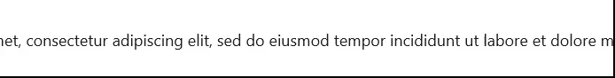

### OpacityMaskView
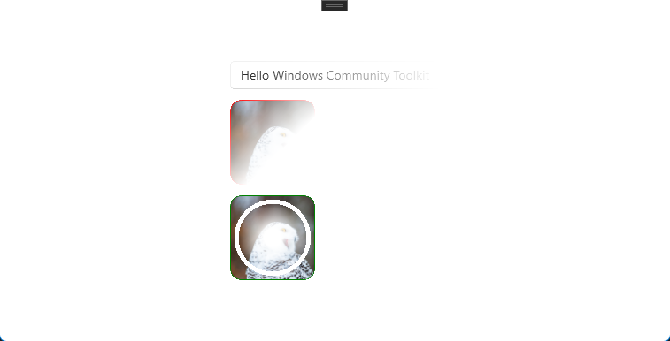

### Ribbon


### Shimmer


### TokenView


### ColorPicker / ColorPickerButton
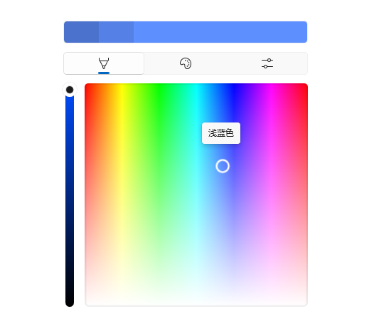

### DockPanel
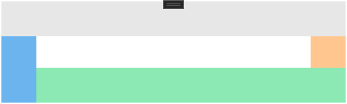

### ImageCropper
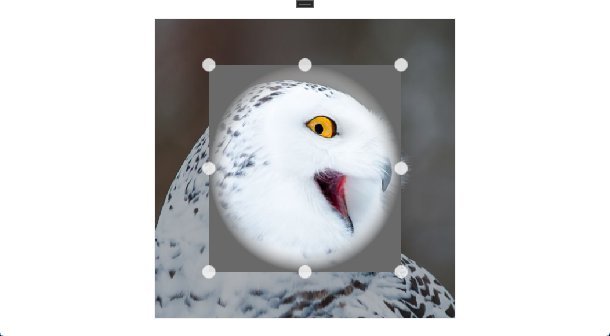

### LayoutTransformControl
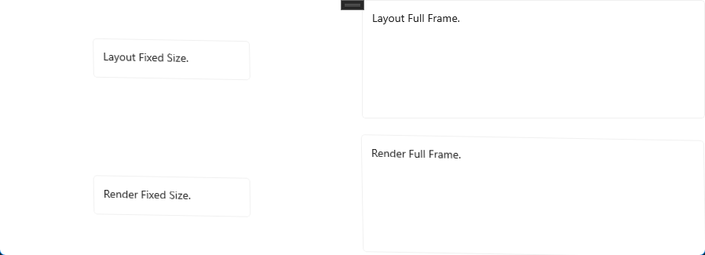

### MetadataControl


### HeaderedContentControl / HeaderedItemsControl / HeaderedTreeView


### ConstrainedBox


### RadialGauge
:warning: The `ValueStringFormat` property **does not support .NET string format syntax** and only supports **std::format syntax**.

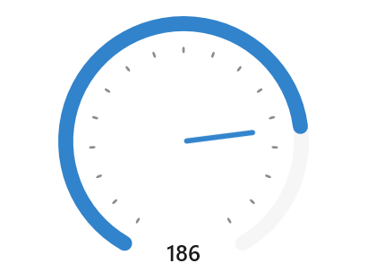

### RangeSelector


### GradientSlider
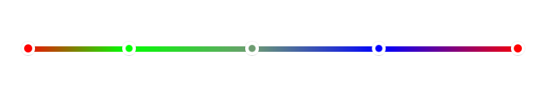

### RichSuggestBox


### Segmented
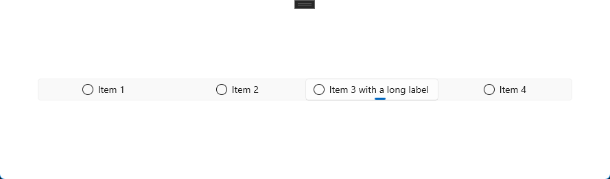

### SettingsCard / SettingsExpander
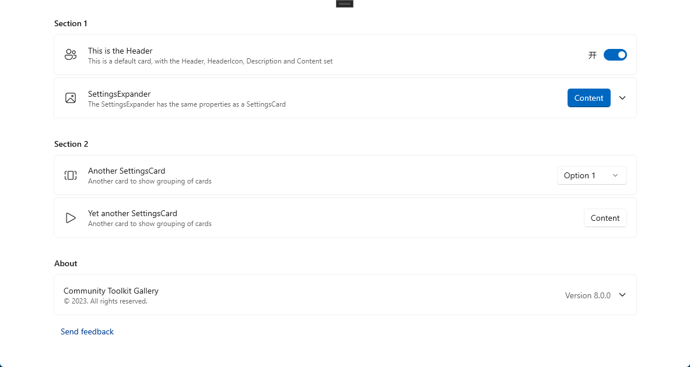

### ContentSizer / GridSplitter / PropertySizer
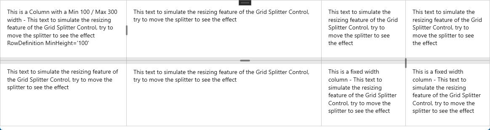

### StaggeredLayout / StaggeredPanel
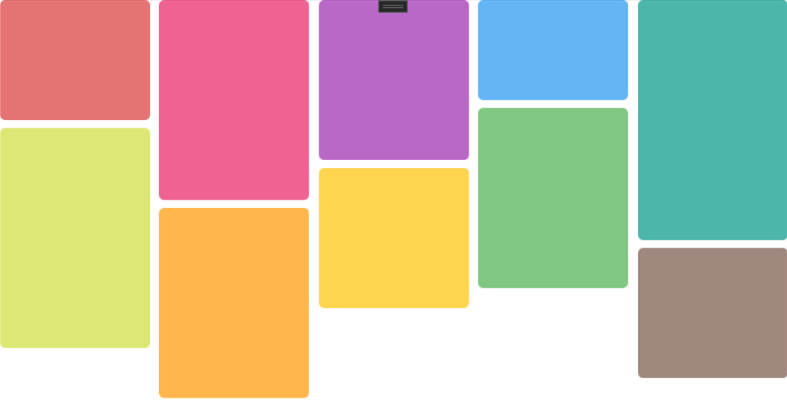

### SwitchPresenter


### TabbedCommandBar
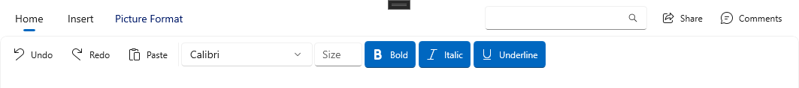

### TokenizingTextBox
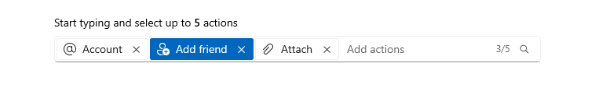

### UniformGrid
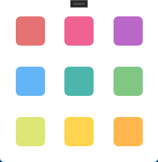

### WrapPanel / WrapPanel2
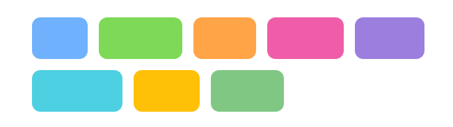

### AttachedDropShadow / AttachedCardShadow


### XamlCompositionEffectBrush

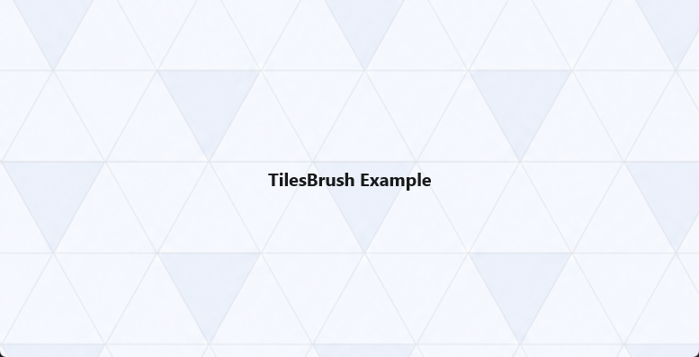

### TransitionHelper


---

## XamlToolkit.WinUI.Animations
### ImplicitAnimations / ExplicitAnimations / ShadowAnimations


### EffectAnimations (XamlToolkit.WinUI.Media.Animations)
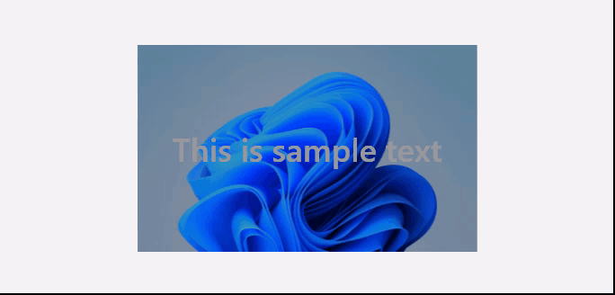

---

## XamlToolkit.WinUI.Interactivity

A C++/WinRT port of [XamlBehaviors](https://github.com/microsoft/XamlBehaviors), providing a lightweight behavior and trigger system for WinUI 3 applications.

This module ports the original C# WinUI XamlBehaviors implementation to C++/WinRT, while keeping full API compatibility for seamless migration.

### Notes

- `ChangePropertyAction` and `CallMethodAction` are not implemented (due to lack of reflection support in C++/WinRT); instead, property mutation is split into:
  - `ChangeCustomPropertyAction`
  - `ChangeDependencyPropertyAction`
  
- `DataTriggerBehavior` may not work with certain types.
- `EventTriggerBehavior` includes default event mappings; missing events must be manually registered via `EventManager`.
---

## XamlToolkit.WinUI.Behaviors


---

## Features

- Native C++/WinRT implementation for WinUI 3.
- API style compatible with CommunityToolkit controls.

## Build Steps

- Requires **Visual Studio 2026** or later for compilation.  
- To build `XamlToolkit.Labs.WinUI`, you need to install **tree-sitter** via vcpkg:

```powershell
vcpkg install tree-sitter:x64-windows-static
```
Markdown parsing uses **md4c** (<https://github.com/mity/md4c>).  
Since vcpkg does not support configuring UTF-16 character set for md4c, the project directly includes the md4c source code.

## Usage

### NuGet

Add nuget packages to your project.	

Add an XML namespace like this in your XAML

```bash
xmlns:ui="using:XamlToolkit.WinUI"
xmlns:controls="using:XamlToolkit.WinUI.Controls"
xmlns:convertors="using:XamlToolkit.WinUI.Convertors"
xmlns:labs="using:XamlToolkit.Labs.WinUI"
xmlns:media="using:XamlToolkit.WinUI.Media"
```


