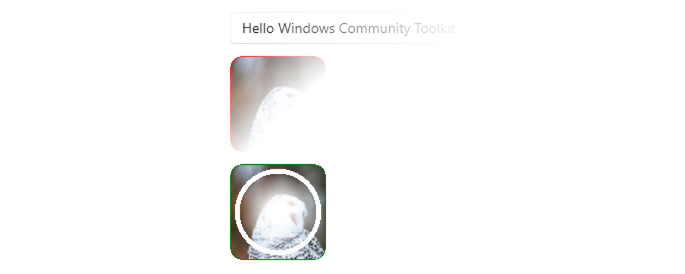
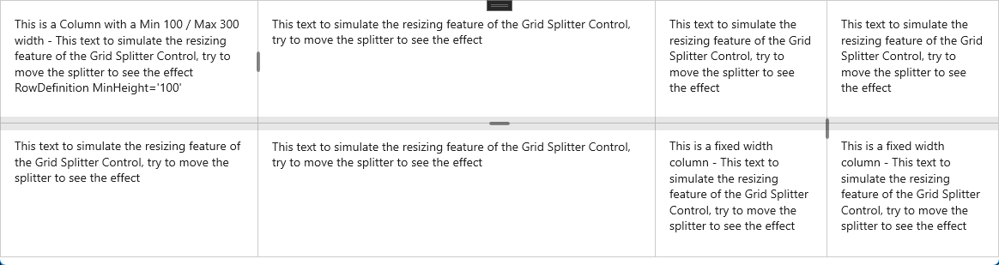

# WinUI Community Toolkit (C++ Port)

This repository contains **C++ ports** of [CommunityToolkit](https://github.com/CommunityToolkit) components.

The goal is to allow seamless usage of these controls in WinUI 3 / C++ projects.

---

## Controls

### MarkdownTextBlock

### Marquee

### OpacityMaskView

### Shimmer

### ColorPicker / ColorPickerButton

### DockPanel

### ImageCropper

### LayoutTransformControl

### MetadataControl

### RadialGauge

### RangeSelector

### Segmented

### SettingsCard / SettingsExpander

### ContentSizer / GridSplitter / PropertySizer

### StaggeredLayout

### SwitchPresenter

### TabbedCommandBar

### UniformGrid

### AttachedCardShadow

---

## Features

- Native C++/WinRT implementation for WinUI 3.
- API style compatible with CommunityToolkit controls.

---
